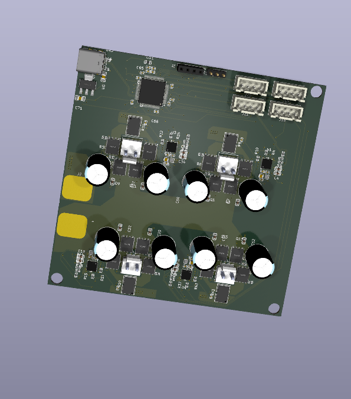

# 4C

Four-channel brushed DC motor controller board built around an STM32G4, DRV8701 gate drivers, and discrete MOSFET bridges.

## Layout

- `hardware/kicad/4C.kicad_pro` - open this in KiCad
- `hardware/kicad/libs/` - project-local imported parts and 3D models
- `firmware/cubemx/` - STM32CubeMX config
- `docs/datasheets/` - datasheets and layout notes

Generated manufacturing files live outside the source project under `hardware/fab/` and are ignored by git. Local leftovers and old exports are parked under `hardware/_local/`, also ignored.

Hardware is still in progress; check the schematic, BOM, and fab outputs before ordering.
